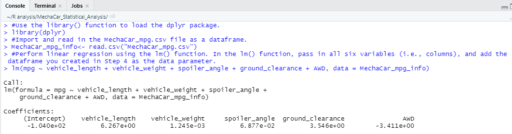
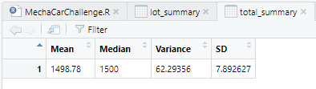
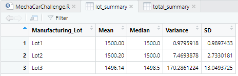
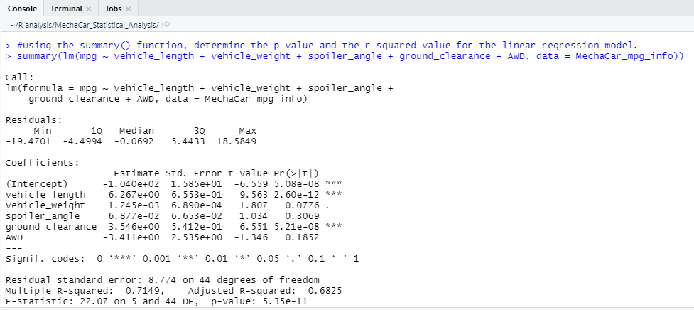
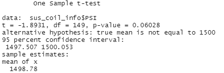
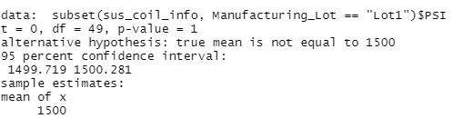
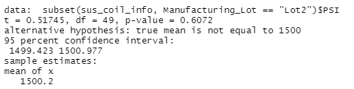
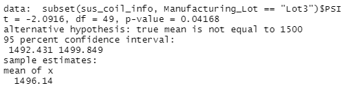

# MechaCar_Statistical_Analysis  

## Background 
A few weeks after starting his new role, Jeremy is approached by upper management about a special project. AutosRUs’ newest prototype, the MechaCar, is suffering from production troubles that are blocking the manufacturing team’s progress. AutosRUs’ upper management has called on Jeremy and the data analytics team to review the production data for insights that may help the manufacturing team. 

In this challenge, you’ll help Jeremy and the data analytics team do the following: 

  * Perform multiple linear regression analysis to identify which variables in the dataset predict the mpg of MechaCar prototypes 
  * Collect summary statistics on the pounds per square inch (PSI) of the suspension coils from the manufacturing lots 
  * Run t-tests to determine if the manufacturing lots are statistically different from the mean population 
  * Design a statistical study to compare vehicle performance of the MechaCar vehicles against vehicles from other manufacturers. For each statistical analysis, you’ll write a summary interpretation of the findings. 

## What I Have Created 
This new assignment consists of three technical analysis deliverables and a proposal for further statistical study. You’ll submit the following: 

  * Deliverable 1: Linear Regression to Predict MPG 
  * Deliverable 2: Summary Statistics on Suspension Coils 
  * Deliverable 3: T-Test on Suspension Coils 
  * Deliverable 4: Design a Study Comparing the MechaCar to the Competition 

### Deliverable 1: Linear Regression to Predict MPG 
The dataset contains mpg test results for 50 prototype MechaCars. The MechaCar prototypes were produced using multiple design specifications to identify ideal vehicle performance. Multiple metrics, such as vehicle length, vehicle weight, spoiler angle, drivetrain, and ground clearance, were collected for each vehicle. Using my knowledge of R, I designed a linear model that predicts the mpg of MechaCar prototypes using several variables from the MechaCar_mpg.csv file.  

  

### Deliverable 2: Create Visualizations for the Trip Analysis 
The dataset contains the results from multiple production lots. In this dataset, the weight capacities of multiple suspension coils were tested to determine if the manufacturing process is consistent across production lots. Using my knowledge of R, I have created a summary statistics table to show:

 * The suspension coil’s PSI continuous variable across all manufacturing lots: 
 
  
 * The following PSI metrics for each lot: mean, median, variance, and standard deviation:  
  

### Deliverable 3: T-Tests on Suspension Coils 
Using my knowledge of R, I performed t-tests to determine if all manufacturing lots and each lot individually are statistically different from the population mean of 1,500 pounds per square inch. 

### Deliverable 4: Design a Study Comparing the MechaCar to the Competition 
Using my knowledge of R, I designed a statistical study to compare performance of the MechaCar vehicles against performance of vehicles from other manufacturers.  

## Results 

### Linear Regression to Predict MPG 

 * <b>Which variables/coefficients provided a non-random amount of variance to the mpg values in the dataset?</b> 
   Thinking critically about the variables/coefficients that provide a non-random amount of variance from our dataset would be the vehicle length and ground clearance.
 * <b>Is the slope of the linear model considered to be zero? Why or why not?</b> 
   Looking at our data, the p-value is 5.35e-11.  Because of this statistic, the assumed significance level is 0.05% and our data is lower than that assumption.  This leads us to think that the slope of the linear model is not zero and such, there is enough statistical evidence to reject the null hypothesis.    
 * <b>Does this linear model predict mpg of MechaCar prototypes effectively? Why or why not?</b> 
   Our model has an r-squared value of 0.7149.  Rounded up, we can assume that ~72% of our predictions for MPG will be correct and because of this statistical data, we can say that our linear model is effective in predicting MPG.
  

  

### Summary Statistics on Suspension Coils 

 * <b>The design specifications for the MechaCar suspension coils dictate that the variance of the suspension coils must not exceed 100 pounds per square inch. Does the current manufacturing data meet this design specification for all manufacturing lots in total and each lot individually? Why or why not?</b> 
  Looking at the variance result in our total summary table above in the Deliverable 2 section, we have a reading of 62.29.  That is well under our 100 pounds per square inch threshold so therefore, we have met the design specifications for the MechaCar suspension coils. 
    
  Now the lot summary table tells a little bit different of a story.  Lot 1 and Lot 2 have met the design specifications but with Lot 3 having an enormous variance reading above the threshold, it does not meet the design specifications.  
     

### T-Tests on Suspension Coils 
Lot 1 and Lot 2 p-value statistical readings are similar to the summary p-value but that is not the case for Lot 3. Lot 3 can is significantly different from the summary p-value as shown in the screenshot below.   
  
  
  
  

### Study Design: MechaCar vs Competition 
city or highway fuel efficiency 

   * What metric or metrics are you going to test?
   * What is the null hypothesis or alternative hypothesis?
   * What statistical test would you use to test the hypothesis? And why?
   * What data is needed to run the statistical test?

